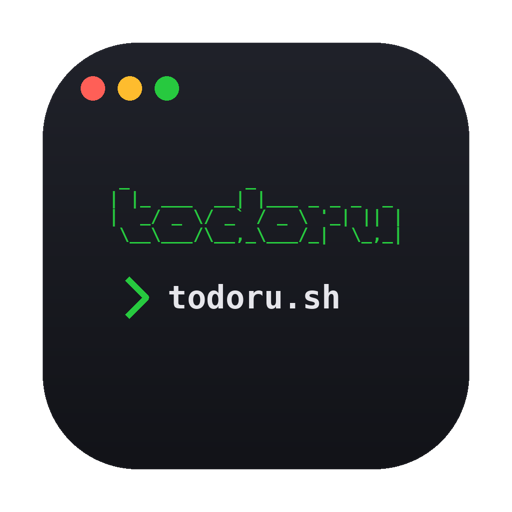

<div align="center">



# todoru.sh

화면 **오른쪽 위**에 떠 있는 cmux 스타일 터미널 TODO 앱.
마우스 대신 **슬래시 명령어**로 할 일을 다룬다.

-black)


[](https://github.com/chromeheartz/todoru.sh/releases/latest)

<br />

### [⬇️ &nbsp; Download for macOS &nbsp; (.dmg)](https://github.com/chromeheartz/todoru.sh/releases/latest)

<sub>Apple Silicon · 최신 릴리즈로 이동합니다</sub>

</div>

---

## ✨ 특징

- 🖥️ 항상 위에 떠 있는 **우상단 플로팅 창** (프레임리스 · 반투명)
- ⌨️ `/add`, `/delete`, `/update` 같은 **슬래시 명령어**로 조작
- 🧭 `/` 만 쳐도 뜨는 **자동완성 명령 팔레트** (명령어를 몰라도 OK)
- ✅ 할 일 항목을 **클릭하면 완료 토글**, 다시 클릭하면 해제
- ✋ 할 일 항목 **드래그앤드롭으로 순서 변경**
- 🪟 **리스트 / 명령 출력 콘솔이 따로 스크롤** — 명령이 쌓여도 할 일은 안 밀림
- 🎨 콘솔 텍스트 색을 **내 맘대로 커스텀** (`/input-color`, `/output-color`)
- 💾 입력 즉시 **자동 저장** (재실행해도 유지)
- 🌙 모노스페이스 + 신호등 점, 다크 **터미널 디자인**
- 🇰🇷🇯🇵 한글 IME 입력 정상 지원

---

## 📦 설치 (비개발자용 — 터미널 필요 없음)

> **Apple Silicon (M1/M2/M3…) Mac 전용** 빌드예요. Intel Mac은 아래 [직접 빌드](#%EF%B8%8F-개발--직접-빌드)를 참고하세요.

1. **[Releases](../../releases)** 페이지에서 최신 `todoru.sh-x.x.x-arm64.dmg` 다운로드
2. 받은 `.dmg`를 더블클릭 → **todoru.sh**를 `Applications` 폴더로 드래그
3. 처음 실행할 때 *"개발자를 확인할 수 없습니다"* 경고가 떠요 (앱 서명을 안 했기 때문):
   - **Applications 폴더에서 todoru.sh 아이콘 우클릭 → 열기 → 열기** 를 한 번만 해주면 이후엔 그냥 클릭으로 실행돼요.
   - 만약 *"손상되었기 때문에 열 수 없습니다"* 가 뜨면, 터미널에 아래 한 줄을 붙여넣고 다시 여세요:
     ```bash
     xattr -cr "/Applications/todoru.sh.app"
     ```

설치되면 **Spotlight(`⌘Space`)에서 `todoru` 검색** 하거나 Launchpad에서 클릭해 실행합니다.

---

## ⌨️ 명령어

입력창에 `/` 를 치면 전체 명령어가 자동완성으로 떠요.
**↑ ↓** 이동 · **Tab** 자동완성 · **Enter** 실행 · **Esc** 닫기.

**할 일 관리**

| 명령어 | 설명 | 별칭 |
|--------|------|------|
| `/add <할일>` | 할 일 추가 (그냥 텍스트만 쳐도 추가됨) | |
| `/delete <n>` | n번 할 일 삭제 | `/del`, `/rm` |
| `/update <n> <할일>` | n번 할 일 내용 수정 | `/edit` |
| `/done <n>` | n번 완료 / 미완료 토글 (항목 클릭으로도 가능) | `/check` |
| `/list` | 전체 할 일 출력 | `/ls` |
| `/delete-all` | 모든 할 일 삭제 | `/clear-all`, `/reset` |

**콘솔 / 화면**

| 명령어 | 설명 | 별칭 |
|--------|------|------|
| `/clear` | 콘솔 화면만 비움 (할 일은 유지) | `/cls` |
| `/console-open` | 명령 출력 콘솔 열기 | |
| `/console-close` | 명령 출력 콘솔 닫기 | |
| `/input-color <색>` | 내가 친 명령어 텍스트 색 | `/text-color` |
| `/output-color <색>` | 결과 / 답변 텍스트 색 | `/answer-color` |
| `/theme-init` | 콘솔 텍스트 색을 기본값으로 초기화 | `/theme-reset` |
| `/help` | 전체 명령어 보기 | `/?`, `/commands` |

> `n` 은 화면에 보이는 **목록 번호**(`#1`, `#2` …)예요. 드래그로 순서를 바꾸면 번호도 다시 매겨집니다.
> `<색>` 은 `#4ade80` 같은 hex, `rgb(...)`, `red` 등 **유효한 CSS 색**이면 다 돼요. 설정은 저장됩니다.
> **↑ / ↓** 로 이전에 입력한 명령을 다시 불러올 수 있어요 (명령 팔레트가 닫혀 있을 때).

---

## 🛠️ 개발 / 직접 빌드

**요구사항:** [Node.js](https://nodejs.org) 18+ · macOS
(아이콘을 다시 만들 때만 Python 3 + [Pillow](https://pypi.org/project/Pillow/) 필요)

```bash
git clone https://github.com/chromeheartz/todoru.sh.git
cd todoru.sh
npm install

npm start        # 개발 모드로 바로 실행
npm run dist     # .app + .dmg 빌드  → dist/
npm run icon     # 아이콘(.icns) 재생성 → build/
```

빌드한 앱을 설치하려면:

```bash
cp -R "dist/mac-arm64/todoru.sh.app" /Applications/
xattr -cr "/Applications/todoru.sh.app"
codesign --force --deep --sign - "/Applications/todoru.sh.app"
```

### 프로젝트 구조

```
todoru.sh/
├── main.js              # Electron 메인 — 창 생성(우상단 고정)·저장 IPC
├── preload.js           # contextBridge 로 안전하게 API 노출
├── renderer/
│   ├── index.html       # 타이틀바 · 배너 · 리스트 · 프롬프트
│   ├── style.css        # 다크 터미널 테마
│   └── renderer.js      # 명령어 레지스트리 · 자동완성 · 드래그앤드롭
├── build-icon.py        # ASCII "todoru" 터미널 아이콘 생성기 (Pillow)
└── build/icon.icns      # 생성된 앱 아이콘
```

새 명령어는 `renderer.js` 의 `COMMANDS` 배열에 한 덩어리만 추가하면
실행 · `/help` · 자동완성에 **자동 반영**됩니다.

---

## 💾 데이터는 어디에 저장되나요?

```
~/Library/Application Support/todoru/todos.json
```

앱을 지워도 이 파일은 남아요. 완전히 초기화하려면 이 파일을 삭제하면 됩니다.

---

## 📄 라이선스

[MIT](LICENSE) © 2026 utaro
